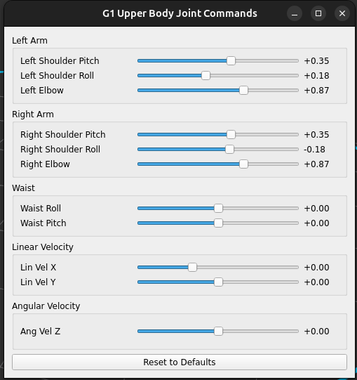

# g1_upperbody_ros2 
Low level control for a Unitree G1 robot implementing safe human imitation with CBF, along with lower body stability and velocity tracking via an RL policy. 

## Prerequisites

### Docker and NVIDIA Container Toolkit 

The package works on both x86 and ARM systems but require an NVIDIA GPU. Docker is used to streamline the installation process. If not already, please install docker and NVIDIA's docker container toolkit on your system. Thus, the following are required; 

1. [Docker](https://docs.docker.com/engine/install/)
2. [NVIDIA Container Toolkit](https://docs.nvidia.com/datacenter/cloud-native/container-toolkit/latest/install-guide.html)

### Simulator
This is designed to work with the unitree mujoco simulator. Please use the fork from the following repository and follow the setup instructions.

[https://github.com/Abanesjo/unitree_mujoco](https://github.com/Abanesjo/unitree_mujoco)

### Remote Controller
For safety especially when integrating with the real robot, the project is designed to work with a controller. This project is specifically calibrated for the Logitech F710 gamepad.

<p align="center">
    
</p>

## Usage

Install and build the docker container using the following command.

```
git clone --recursive https://github.com/Abanesjo/g1_upperbody_ros2
cd docker
docker compose up --build
```

Before proceeding, it's advised to wait until the container finishes compiling the ros packages, which is when you see the message

 **"g1_upperbody_ros2  | Summary: 10 packages finished [27.7s]"**

If not already, grant access to your display for docker applications

```
xhost +local:root
```

Next, enter the docker container

```
docker exec -it g1_upperbody_ros2 bash
```

This will give you access to the workspace within the container. The container already has tmux installed. So you can run

```
tmux
```

and execute the following commands to test the functionality. 

### Motion from data

In one terminal within the container: 
```
ros2 launch g1_cbf bringup.launch.xml rviz:=true simulator:=true
```

And in another terminal: 
```
ros2 launch g1_human g1_human_manual.launch.xml
```

You will see a window below


You can start the RL + CBF with the remote controller. See the [controller](#controls) section for usage instructions.

### Manual Motion

You can also send manual joint commands with the gui, as well as base velocities instead.

In one terminal within the container: 
```
ros2 launch g1_cbf bringup_manual.launch.xml rviz:=true simulator:=true
```
You will get an additional GUI as shown below. 



### Controller

For safety, the project utilizes a joystick for emergency kill switching and toggling between a default stand pose and the policy. The commands are as follows: 

```
LB: Kill Switch (toggles full damping mode)
RB: Toggles between default stand position and RL + Policy
```

### Stopping the container
You can stop the running container via
```
cd docker
docker compose down
```
from a host shell.
